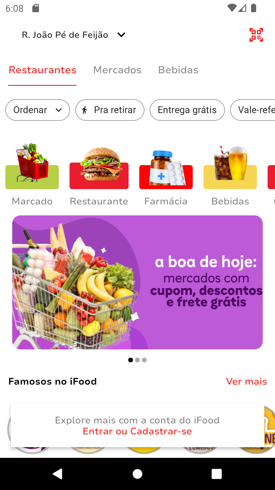
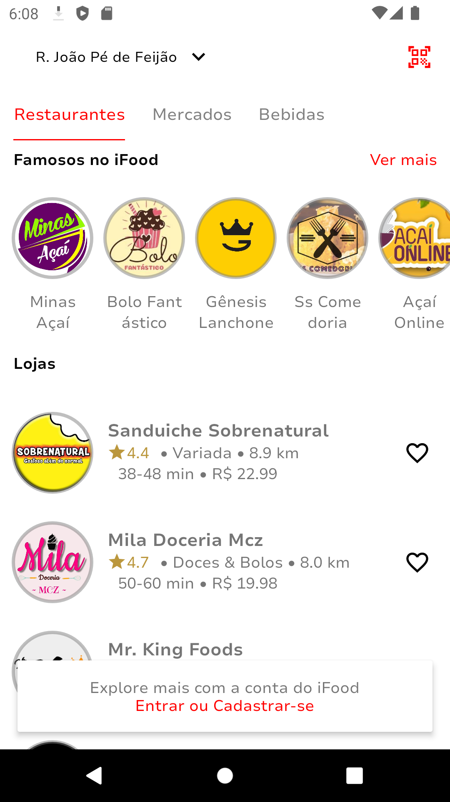

Para documentação em português, consulte o [README em Português](docs/README.pt.md).

# iFood Interface Recreation using Kotlin

This repository contains the recreation of the iFood's home screen, a popular food delivery application, using the Kotlin programming language.

The goal of this project is to demonstrate the ability to recreate iFood's home screen, exploring interface design concepts, layouts, and components using Kotlin.

## Implemented Features

In this project, the following feature has been implemented:

<div style="display: flex; justify-content: space-between;">
    
    
</div>

Home Screen: Displays a list of restaurants with filters and highlights available on iFood.

## How to Run the Project

To run the project on your local machine, follow the steps below:

1. Make sure you have Android Studio installed on your machine.
2. Clone this repository using the git command:
   ```
   git clone https://github.com/eduardomcb/iFoodClone.git
   ```
3. Open Android Studio and import the project.
4. Wait for Android Studio to configure the dependencies and sync the project.
5. Connect an Android device or start an emulator.
6. Run the application by pressing the "Run" button in Android Studio.

Make sure you have the correct versions of dependencies and the Android SDK installed to avoid potential compilation issues.
