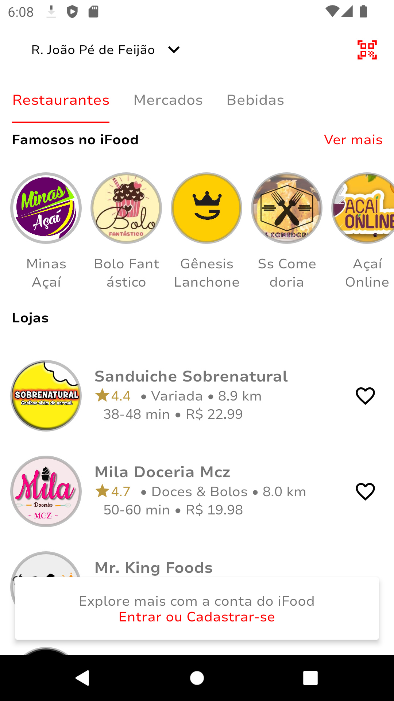

For English documentation, please see the [English README](README.md).

# Recriação da Interface do iFood usando Kotlin

Este repositório contém a recriação da tela inicial do iFood, um aplicativo popular de entrega de alimentos, utilizando a linguagem Kotlin.

O objetivo deste projeto é demonstrar a habilidade de recriar a tela inicial do iFood, explorando conceitos de design de interface, layouts e componentes utilizando Kotlin.

## Funcionalidades Implementadas

Neste projeto, foi implementada a seguinte funcionalidade:

<div style="display: flex; justify-content: space-between;">
    
    
</div>

Tela inicial: Exibe uma lista de restaurantes com filtros e destaques disponíveis no iFood.

## Como Executar o Projeto

Para executar o projeto em sua máquina local, siga as etapas abaixo:

1. Certifique-se de ter o Android Studio instalado em sua máquina.
2. Clone este repositório usando o comando git:
   ```
   git clone https://github.com/eduardomcb/iFoodClone.git
   ```
3. Abra o Android Studio e importe o projeto.
4. Aguarde o Android Studio configurar as dependências e sincronizar o projeto.
5. Conecte um dispositivo Android ou inicie um emulador.
6. Execute o aplicativo pressionando o botão "Run" no Android Studio.

Certifique-se de ter as versões corretas das dependências e do Android SDK instalado para evitar possíveis problemas de compilação.
